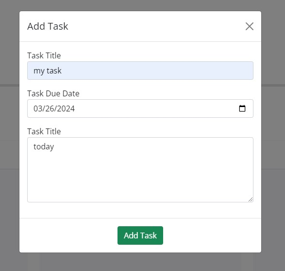
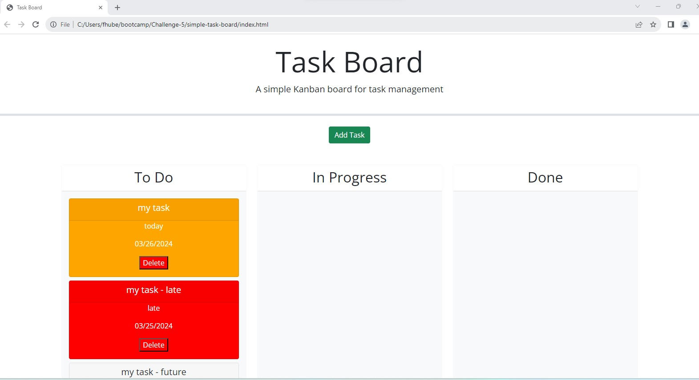
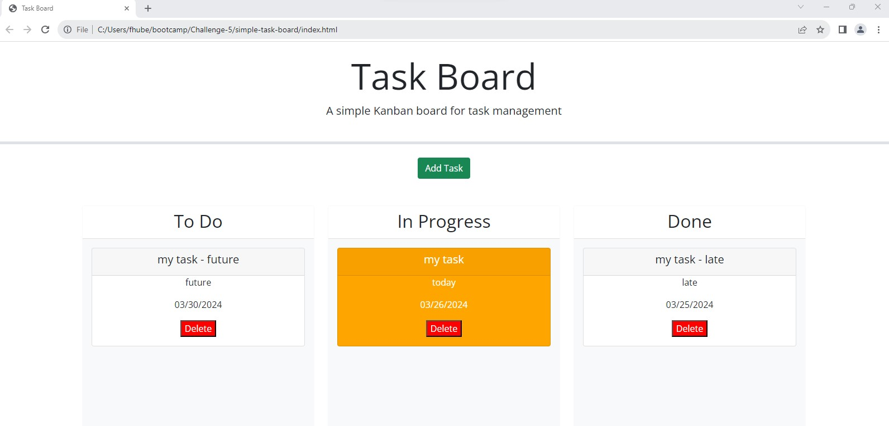

# Simple Task Board

This challenge I will create a simple task board that allows someone to manage project tasks.  

Project runs in a browser.

## User Story

AS A project team member with multiple tasks to organize
I WANT a task board 
SO THAT I can add individual project tasks, manage their state of progress and track overall project progress accordingly

## Acceptance Criteria

WHEN I open the task board
THEN the list of project tasks is displayed in columns representing the task progress state (Not Yet Started, In Progress, Completed)

WHEN I view the task board for the project
THEN each task is color coded to indicate whether it is nearing the deadline (yellow) or is overdue (red)

WHEN I click on the button to define a new task
THEN I can enter the title, description and deadline date for the new task into a modal dialog

WHEN I click the save button for that task
THEN the properties for that task are saved in localStorage

WHEN I drag a task to a different progress column
THEN the task's progress state is updated accordingly and will stay in the new column after refreshing

WHEN I click the delete button for a task
THEN the task is removed from the task board and will not be added back after refreshing

WHEN I refresh the page
THEN the saved tasks persist

## Screenshots

## Deployment

[Task Board](https://fhubert1.github.io/simple-task-board/)

[Repo](https://github.com/fhubert1/simple-task-board)

## Notes

Received assistance with the dragging and dropping of elements from Professor on 3/21 and 3/25 during office hours.  Provided sample code on using the $('#in-progess').droppable logic.  Determined that the event was firing further up the DOM tree than I expected.  